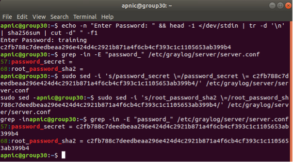
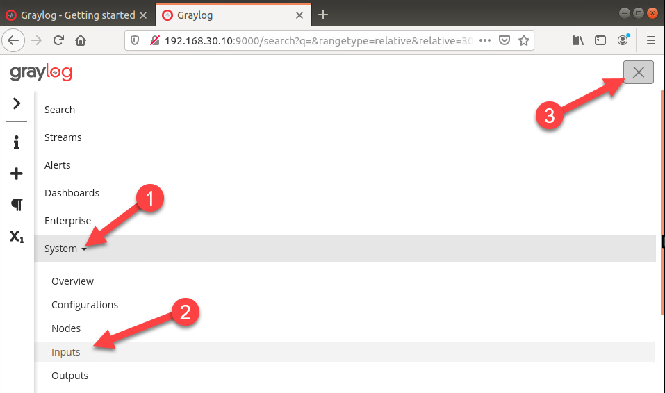

# Part 3 - Setup GrayLog #
## Install the GrayLog Server ##

In this step, we will install the required software to use GrayLog and other resources needed for logging. For more information refer to https://docs.graylog.org/en/4.0/
The steps to complete this section are:
* Update software
* Install required packages
* Install MongoDB (Database server)
* Install Elasticsearch
* Install GrayLog
* Configure GrayLog

Open a terminal window and ssh to the server that will be used to install GrayLog.

    ssh apnic@192.168.30.10

NOTE: Type `yes` if asked about wanting to continue connecting
Password = `training`


* Update the software repository for Ubuntu.

        sudo apt-get update && sudo apt-get -y dist-upgrade


Password = `training`

* Install required packages.

        sudo apt-get install -y apt-transport-https openjdk-8-jre-headless uuid-runtime pwgen


> [!NOTE]
> If an error stating Unable to locate package, enable the universe repository by typing the following command (and retry the install command): `sudo add-apt-repository universe`

* Install MongoDB database server. Refer to the documentation for more details https://www.mongodb.com/what-is-mongodb.

   - Add the trusted key to the apt-key file

            sudo apt-key adv --keyserver hkp://keyserver.ubuntu.com:80 --recv 4B7C549A058F8B6B


   - Add the MongoDB repository to the recommended download list
        
   if required remove older repository link 
    sudo rm /etc/apt/sources.list.d/mongodb-org-4.0.list
    
        echo "deb [arch=amd64] http://repo.mongodb.org/apt/ubuntu bionic/mongodb-org/4.2 multiverse" | sudo tee /etc/apt/sources.list.d/mongodb-org-4.2.list

   - To verify thet MongoDB repository has been added

    cat /etc/apt/sources.list.d/mongodb-org-4.2.list    


   - Update the software repository and install MongoDB
    
    sudo apt-get update

    sudo apt-get install -y mongodb-org policykit-1


* Enable MongoDB to start during the operating system’s boot process and verify it is running.

    * Enable mongod service at bootup

            sudo systemctl daemon-reload
            sudo systemctl enable mongod

    * Start the mongod service and verify status
        
            sudo systemctl restart mongod
            sudo systemctl status mongod


    * NOTE: Press q to quit from the status output

        q

Another way to verify status 
    
    sudo systemctl --type=service --state=active | grep mongod

### Install Elasticsearch. Refer to the documentation for more details 
https://www.elastic.co/what-is/elasticsearch.

Graylog can be used with Elasticsearch 7.x and above. To install the open source version of Elasticsearch, type the following commands.

Download the trusted key
    
    cd ~
    wget -q https://artifacts.elastic.co/GPG-KEY-elasticsearch -O myKey

Add the trusted key to the apt-key file

    sudo apt-key add myKey

Add the Elasticsearch repository to the recommended download list


    echo "deb https://artifacts.elastic.co/packages/oss-7.x/apt stable main" | sudo tee -a /etc/apt/sources.list.d/elastic-7.x.list

verify the repository has been added by executing

    cat /etc/apt/sources.list.d/elastic-7.x.list

Update the software repository and install Elasticsearch

    sudo apt-get update 
    sudo apt-get install -y elasticsearch-oss


* Modify the Elasticsearch configuration file 
    
    /etc/elasticsearch/elasticsearch.yml 
    and set the cluster name to graylog and uncomment action.
    
    auto_create_index: false to enable the action:

    ```
    sudo tee -a /etc/elasticsearch/elasticsearch.yml > /dev/null <<EOL
    cluster.name: graylog
    action.auto_create_index: false
    EOL
    ```

Create an options file in /etc/elastisearch/jvm.options.d/ to limit how much memory Elasticsearch will use. In the below example it will be limited to 512m

    
    sudo tee -a /etc/elasticsearch/jvm.options.d/lowmem.options > /dev/null <<EOL
    -Xms512m
    -Xmx512m
    EOL
    

* Enable Elasticsearch to start during the operating system’s boot process and verify it is running.

* Enable elasticsearch service at bootup

        sudo systemctl daemon-reload
        sudo systemctl enable elasticsearch
    
* Start the elasticsearch service and verify status

        sudo systemctl restart elasticsearch


* Verify the status

        sudo systemctl status elasticsearch

NOTE: Press `q` to **quit** from the status output


Another way to verify status 

    sudo systemctl --type=service --state=active | grep elastic

### Install GrayLog
Refer to the documentation for more details https://docs.graylog.org/en/4.0/.
Download and install the Graylog repository configuration file.

    wget https://packages.graylog2.org/repo/packages/graylog-4.0-repository_latest.deb

    sudo dpkg -i graylog-4.0-repository_latest.deb


Update the software repository and install GrayLog

    sudo apt-get update
    sudo apt-get install graylog-server


* Create a password to use for logging into GrayLog

        echo -n "Enter Password: " && head -1 </dev/stdin | tr -d '\n' | sha256sum | cut -d" " -f1

Password = `training`


This will return a sha256 hash value. Remember this value, as it will need to be added to the GrayLog configuration.

* Update the passwords to the above hash value in the /etc/graylog/server/server.conf file.
    
        grep -in -E "password_" /etc/graylog/server/server.conf
   
        sudo sed -i 's/password_secret \=/password_secret \= c2fb788c7deedbeaa296e424d4c2921b871a4f6cb4cf393c1c1105653ab399b4/' /etc/graylog/server/server.conf

        sudo sed -i 's/root_password_sha2 \=/root_password_sha2 \= c2fb788c7deedbeaa296e424d4c2921b871a4f6cb4cf393c1c1105653ab399b4/' /etc/graylog/server/server.conf

        grep -in -E "password_" /etc/graylog/server/server.conf



> [!IMPORTANT] 
>In production make sure to clear the terminal history, so as to delete the sed command with the password hash shown. Refer to [https://askubuntu.com/questions/191999/how-to-clear-bash-history-completely](https://askubuntu.com/questions/191999/how-to-clear-bash-history-completely).


To clear session history 

        history -c


Update the http_bind_address variable in the /etc/graylog/server/server.conf file.
        grep -in "\#http_bind" /etc/graylog/server/server.conf

        sudo sed -i 's/\#http_bind_address \= 127\.0\.0\.1/http_bind_address \= 192\.168\.30\.10/' /etc/graylog/server/server.conf

        grep -in "http_bind_address \=" /etc/graylog/server/server.conf


* Enable GrayLog to start during the operating system’s boot process and verify it is running.

Enable graylog service at bootup

        sudo systemctl daemon-reload
        sudo systemctl enable graylog-server

Start the graylog service and verify status

        sudo systemctl restart graylog-server

        sudo systemctl status graylog-server

NOTE: Press **q to quit** from the status output

        q

Another way to verify status 

        sudo systemctl --type=service --state=active | grep graylog

* To verify that graylog is receiving logs, type the following command:

        sudo tail -f /var/log/graylog-server/server.log

NOTE: Press `ctrl+c` to **quit** from the status output

### Access the Web Interface
* Use Firefox and browse to the GrayLog HTTP server
`http://group30-server.apnictraining.net:9000` 

This is a known error with GrayLog 4. For more detail refer to [https://community.graylog.org/t/4-0-upgrade-browser-access-failure-with-dns-name-but-ip-works/17957/4](https://community.graylog.org/t/4-0-upgrade-browser-access-failure-with-dns-name-but-ip-works/17957/4)


* Optional - To allow access via the Fully Qualified Domain Name (FQDN), update the variable http_enable_cors in /etc/graylog/server/server.conf. For detail about Cross-Origin Resource Sharing (CORS), refer to https://developer.mozilla.org/en-US/docs/Web/HTTP/CORSgrep -in cors /etc/graylog/server/server.conf


        grep -in cors /etc/graylog/server/server.conf
    
        sudo sed -i 's/\#http_enable_cors \= false/http_enable_cors \= true/' /etc/graylog/server/server.conf
    
        grep -in cors /etc/graylog/server/server.conf

        sudo systemctl restart graylog-server


Return to Firefox and refresh the page or browse to the GrayLog's FQDN http://group30-server.apnictraining.net:9000


Open another Firefox tab and browse to the GrayLog HTTP server `http://192.168.30.10:9000
Username =`admin`
Password =`training`

In the web page, create a new pipeline to receive UDP syslog message on port 5144.Goto System > Inputs. From the select input drop down choose `Syslog UDP` and click on Launch new input. If the screen resolution is too small, the file menu is not display. Click on the top right-hand corner hamburger icon (the trigram symbol ☰), to see the menu options.

* Click on trigram symbol ☰


* click on system and then inputs, then click on X at cornor



* From drop down menu click on <span style="color: black; background-color: lightgrey;">Syslog UDP</span> or type Syslog UDP


* Click on **<span style="whitecolor: white; background-color: green;">Launch new Input</span>**


* After Launch new Syslog UDP input select the following option:
    * Node: group30.apnictraining.net
    * Title: syslog
    * Bind Address: 0.0.0.0
    * Port: 5144


## Configure Export of Syslog on Devices
### Configure Cisco IOS-XE router, R1  

Select IOS-R1 from the Resources tab.
Log into R1 and enter the Privileged EXEC mode.
To enter Privileged EXEC mode type the following

        enable

Configure the router interfaces.
Check the lab topology and the table of IP/ASN assignment at the beginning of the instructions for details.

    conf t
        int gi1
           description link to Remote syslog
            ip address 192.168.30.1 255.255.255.0
            no shutdown
        int gi2
            description link to R2
            ip address 172.16.0.1 255.255.255.252
            no shutdown
        int gi3
            description link to R3
            ip address 172.16.0.5 255.255.255.252
            no shutdown
            exit
    exit

Test connectivity from R1 to the syslog-ng Server:

    ping 192.168.30.10 

If your Ping Fails, Go back to your **ubuntu-vm** from the Resources tab and execute the following

    sudo apt install net-tools

    sudo ifconfig lxcbr0 down

    sudo ifconfig lxcbr0 up

Then try and ping R1

    ping 192.168.30.1


* To configure the router to send information to syslog, type the following commands:
* The default port is 514, change it to **<span style="whitecolor: white; background-color: green;">5144</span>**

  ```bash  
  enable
    conf t
        logging host 192.168.30.10 transport udp port 5144
        logging facility local0
        logging userinfo
        end
    wr
    ```


Confirm logging is enabled by executing:

    show logging


NOTE: Press `q` to quit from the output

* Go back to your **ubuntu-vm** from the Resources tab and check the Gray log web interface


Zoom out to have full view of web interface


The log from **R1= 192.168.30.1** as source IP would be displayed

* Verify the source
* Timestamp
* Message


### OPTIONAL - Configure logging on a Juniper device

Select **Junos-R3** from the Resources tab.

Log into R3 User = `apnic` Password = `Tr@ining`

Configure the router interfaces for R3. 

    configure
    top edit interfaces
 
    set ge-0/0/0 unit 0 description "Link to Remote syslog"
    set ge-0/0/0 unit 0 family inet address 192.168.30.3/24
 
    set ge-0/0/1 unit 0 description "Link to R1"
    set ge-0/0/1 unit 0 family inet address 172.16.0.6/30
 
    set ge-0/0/2 unit 0 description "Link to R2"
    set ge-0/0/2 unit 0 family inet address 172.16.0.10/30
    commit and-quit

Confirm the interface IP addresses: 

    show interface terse

Test connectivity from R3 to the syslog-ng Server:

    ping 192.168.30.10 count 3

Confirm current syslog configuration: 

    show configuration system syslog 

Configure logging for R3. configure

    configure
    top edit system
 
    set syslog host 192.168.30.10 port 5144 any any 
    set syslog host 192.168.30.10 facility-override local0
    set syslog host 192.168.30.10 source-address 192.168.30.3
    
    set syslog user * any info
    
    commit and-quit

Review the updated syslog configuration: 

    show configuration system syslog 

Verify the Syslog export to Graylog server

    show log messages | match 192.178.30.10

Go back to your **ubuntu-vm** from the Resources tab and check the Gray log web interface 

click on the bar next to clock icon and select last 5 or 10 minutes and scroll down to see more messages and notice the source would be R1/R3.


### Optional Configure Cisco IOS-XE router, R2  

Select IOS-R2 from the Resources tab.
Log into R2 and enter the Privileged EXEC mode.
To enter Privileged EXEC mode type the following

        enable

Configure the router interfaces.
Check the lab topology and the table of IP/ASN assignment at the beginning of the instructions for details.

Configure the router interfaces for R2.

    conf t
        int gi1
           description link to Remote syslog
            ip address 192.168.30.2 255.255.255.0
            no shutdown
        int gi2
            description link to R1
            ip address 172.16.0.2 255.255.255.252
            no shutdown
        int gi3
            description link to R3
            ip address 172.16.0.9 255.255.255.252
            no shutdown
        end
    wr
To configure the router to send information to syslog, type the following commands: 


    enable
        conf t
            logging host 192.168.30.10 transport udp port 5144
            logging facility local0
            logging userinfo
            end
        wr

Test connectivity from R2 to the Graysyslog Server:

    ping 192.168.30.10

Verify the logging from the device

    show running-config | section logging


To Confirm logging is enabled by executing:

    show logging 


[def]: images/20250216-Gray-log-SYSLOG-mongodb-repository-102.png
